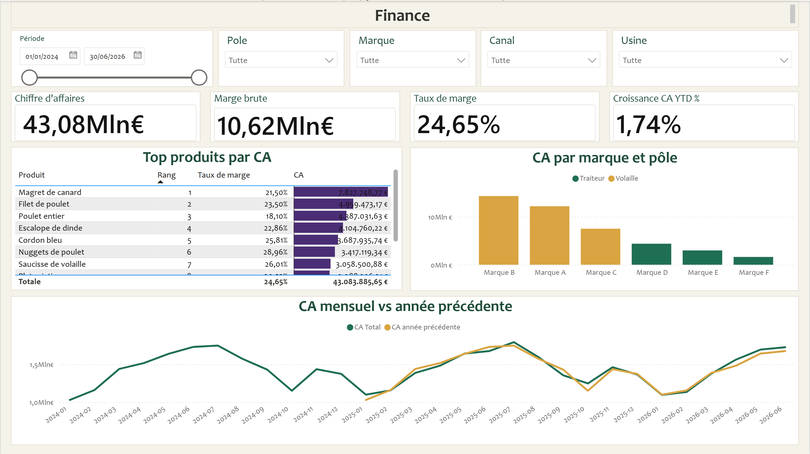
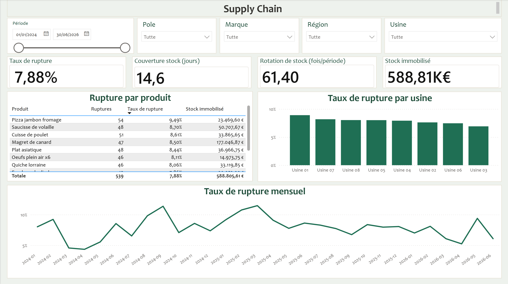
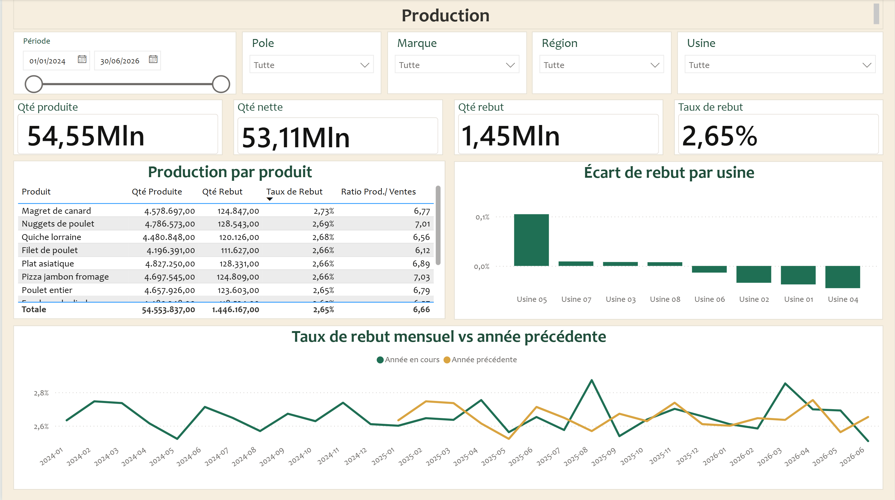
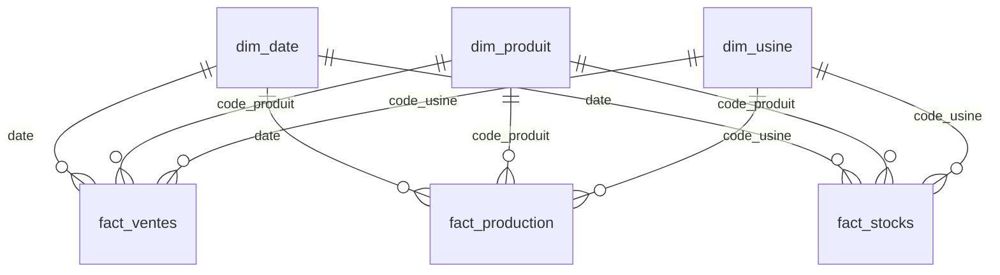

# Observatoire Agroalimentaire

Un tableau de bord Power BI pour suivre l'activité d'une entreprise agroalimentaire (volaille et traiteur) sur trois axes : la finance, la supply chain et la production. L'idée de départ était simple : partir de fichiers plats et arriver à un tableau de bord interactif, sans dépenser un euro de licence.

C'est un projet portfolio. Il met en avant un modèle en étoile propre, une bibliothèque de 30 mesures DAX et un dashboard de trois pages, le tout sur des données synthétiques et anonymisées.

## Aperçu

| Finance | Supply Chain | Production |
|---|---|---|
|  |  |  |


## Ce que montre le tableau de bord

Chaque page couvre un domaine.

La page **Finance** suit le chiffre d'affaires, la marge brute, le taux de marge et la croissance depuis le début de l'année comparée à l'an dernier. On y trouve aussi le top des produits et la répartition du CA par marque et par pôle.

La page **Supply Chain** regarde le taux de rupture, la couverture et la rotation de stock, ainsi que la valeur du stock immobilisé, avec le détail des ruptures par produit et par site.

La page **Production** affiche les quantités produites, nettes et mises au rebut, le taux de rebut, l'écart de rebut par site et la tendance comparée à l'an dernier.

Les trois pages partagent les mêmes filtres : période, pôle, marque, canal ou région, et site. Ils sont synchronisés, donc on garde le même contexte quand on passe d'un domaine à l'autre.

## Le modèle de données

C'est un modèle en étoile classique. Trois tables de faits (ventes, production, stocks) sont reliées à trois dimensions (date, produit, site). Toutes les relations vont dans un seul sens, de la dimension vers le fait. J'ai volontairement écarté les relations bidirectionnelles, qui créent des chemins de filtre ambigus dès qu'il y a plusieurs faits.



Un point mérite qu'on s'y arrête : les ventes sont journalières, mais la production et les stocks sont des photos hebdomadaires. Le stock ne s'additionne donc jamais dans le temps, il est traité en semi-additif. Le détail des tables, des granularités et des contrôles qualité se trouve dans [`docs/DATA-DICTIONARY.md`](docs/DATA-DICTIONARY.md).

## Les mesures DAX

La bibliothèque compte 30 mesures, rangées par domaine. Trois patterns portent l'essentiel du travail.

Le premier est le **stock semi-additif**. Comme le stock est une photo hebdomadaire, on ne le somme pas sur la période : on prend la dernière valeur connue avec `LASTNONBLANKVALUE`, plus une variante qui reporte la valeur en avant.

Le deuxième est la **time intelligence** (YoY, YTD, MAT), avec un garde-fou de comparabilité. Quand la période N-1 n'est pas couverte par le calendrier, la mesure renvoie un blanc plutôt qu'une comparaison faussée.

Le troisième est le **classement dynamique**, qui recalcule le rang des produits par chiffre d'affaires selon les filtres actifs.

Tout est documenté mesure par mesure dans [`docs/misure_dax.md`](docs/misure_dax.md). Pour les créer d'un seul coup dans la vue requête DAX, il y a aussi [`docs/misure_dax_bulk.dax`](docs/misure_dax_bulk.dax).

## Les données

Les données sont entièrement synthétiques. Elles sont produites par `generate_dataset.py`, avec un seed fixe (42) pour rester reproductibles, sur la période du 1er janvier 2024 au 30 juin 2026. Les marques et les sites sont anonymisés (Marque A à F, Usine 01 à 08). Aucune donnée réelle d'entreprise n'est utilisée.

Pour regénérer le jeu de données et lancer les contrôles :

```bash
python generate_dataset.py    # écrit les 5 CSV dans dataset/
python valida_dataset.py      # intégrité référentielle, doublons, plages de dates, ruptures, rebut
```

## Les outils

Power BI Desktop pour le DAX, Python et Pandas pour générer et valider les données, GitHub pour le dépôt. Aucune licence payante.

## Organisation du dépôt

```
observatoire-agroalimentaire/
├── cockpit-agroalimentaire.pbix     # le modèle et les 3 pages
├── generate_dataset.py              # génération des données (seed 42)
├── valida_dataset.py                # contrôles qualité
├── dataset/                         # 5 CSV : 2 dimensions et 3 faits
└── docs/
    ├── DATA-DICTIONARY.md           # schéma, granularités, qualité
    ├── misure_dax.md                # les 30 mesures, documentées
    ├── misure_dax_bulk.dax          # les 30 mesures en un bloc
    └── img/                         # captures des 3 pages
```
