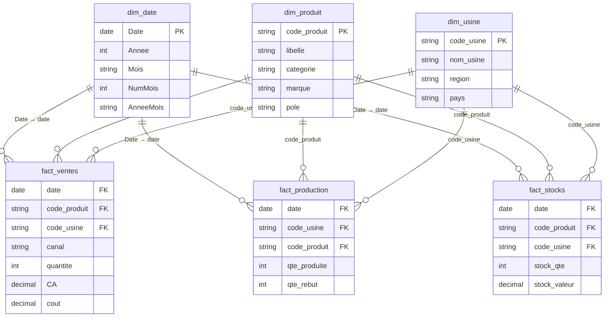

# DATA DICTIONARY — Progetto DAX / Cockpit Agroalimentaire

> Fonti, schemi e qualità dei dati. Aggiornato in F0 (validazione dei 5 CSV).

## Fonti

| Fonte | Tipo | Accesso | Refresh | Owner | Note |
|---|---|---|---|---|---|
| `dim_produit.csv` | CSV | cartella progetto | statico | `generate_dataset.py` (seed 42) | 12 righe, marchi anonimizzati A–F |
| `dim_usine.csv` | CSV | cartella progetto | statico | idem | 8 righe, siti anonimizzati 01–08 |
| `fact_ventes.csv` | CSV | cartella progetto | statico | idem | 42 534 righe, granularità **giornaliera** |
| `fact_production.csv` | CSV | cartella progetto | statico | idem | 5 795 righe, granularità **settimanale (lunedì)** |
| `fact_stocks.csv` | CSV | cartella progetto | statico | idem | 6 840 righe, snapshot **settimanale (lunedì)** |
| `dim_date` | calculated table DAX | creata in Power BI (F2) | — | Gabriele | `CALENDAR(2024-01-01; 2026-06-30)`, da marcare come date table |

## Schema: dim_produit

| Colonna | Tipo | Nullable | Descrizione | Problemi noti |
|---|---|---|---|---|
| `code_produit` | text | no | PK — P001…P012 | — |
| `libelle` | text | no | Nome prodotto (FR) | — |
| `categorie` | text | no | Volaille brute / Decoupe / Elabore / Traiteur / Oeufs | — |
| `marque` | text | no | Marque A…F (anonimizzato) | — |
| `pole` | text | no | Volaille / Traiteur | — |

## Schema: dim_usine

| Colonna | Tipo | Nullable | Descrizione | Problemi noti |
|---|---|---|---|---|
| `code_usine` | text | no | PK — U01…U08 | — |
| `nom_usine` | text | no | Usine 01…08 (anonimizzato) | — |
| `region` | text | no | Ouest / Nord-Ouest / Sud-Ouest / Centre-Est / Europe | — |
| `pays` | text | no | France (7) / Pologne (1) | — |

## Schema: fact_ventes

| Colonna | Tipo | Nullable | Descrizione | Problemi noti |
|---|---|---|---|---|
| `date` | date | no | Giorno della vendita (granularità giornaliera, 912 giorni consecutivi) | — |
| `code_produit` | text | no | FK → `dim_produit` | — |
| `code_usine` | text | no | FK → `dim_usine` | — |
| `canal` | text | no | GMS (55%) / RHF (20%) / Export (15%) / Industrie (10%) | Attributo di fatto, non dimensione: usarlo come slicer diretto sul fact |
| `quantite` | int | no | Unità vendute | — |
| `CA` | decimal | no | Ricavo netto (già scontato) in EUR | Nome colonna in MAIUSCOLO: attenzione nelle formule DAX |
| `cout` | decimal | no | Costo del venduto in EUR | — |

## Schema: fact_production

| Colonna | Tipo | Nullable | Descrizione | Problemi noti |
|---|---|---|---|---|
| `date` | date | no | Lunedì della settimana di produzione (131 snapshot) | Granularità ≠ da `fact_ventes` |
| `code_usine` | text | no | FK → `dim_usine` | — |
| `code_produit` | text | no | FK → `dim_produit` | — |
| `qte_produite` | int | no | Unità prodotte nella settimana | — |
| `qte_rebut` | int | no | Unità scartate | Additivo, ok da sommare |

## Schema: fact_stocks

| Colonna | Tipo | Nullable | Descrizione | Problemi noti |
|---|---|---|---|---|
| `date` | date | no | Lunedì dello snapshot (131 snapshot) | **Snapshot, non flusso** |
| `code_produit` | text | no | FK → `dim_produit` | — |
| `code_usine` | text | no | FK → `dim_usine` | — |
| `stock_qte` | int | no | Giacenza puntuale | **Semi-additivo**: sommarlo nel tempo è un errore |
| `stock_valeur` | decimal | no | Giacenza valorizzata (75% del prezzo di vendita) | Idem |

## Relazioni (modello a stella)

Tutte le relazioni: **uno-a-molti, cross-filter single-direction** (dim → fact). Nessuna bidirezionale: con 3 fact tables produrrebbe ambiguità.

## Qualità dati — findings (F0, 2026-07-13)

| Data | Fonte | Problema | Impatto | Gestione |
|---|---|---|---|---|
| 2026-07-13 | tutte | **Nessuna violazione di integrità referenziale**: 0 FK orfane, 0 null, chiavi dim uniche | — | Nessuna azione |
| 2026-07-13 | tutte | Nessun duplicato sulla chiave di grana, nessun valore negativo o nullo | — | Nessuna azione |
| 2026-07-13 | `fact_production` / `fact_stocks` | Granularità **settimanale (solo lunedì)** contro `fact_ventes` giornaliera | Su un filtro "giorno" non-lunedì le misure stock/production tornano blank | Misure semi-additive (`LASTNONBLANKVALUE`) in `misure_dax.md`; la dashboard lavora a granularità settimana/mese, mai al giorno singolo |
| 2026-07-13 | `fact_stocks` | 539 righe con `stock_qte = 0` (**7,88%** = rotture) | È il segnale voluto per il KPI Taux de Rupture | Nessuna pulizia: sono dati validi, non scarti |
| 2026-07-13 | `fact_ventes` | `CA` è già al netto della remise; la remise non è una colonna | Impossibile misurare l'impatto sconto | Accettato: fuori scope (what-if parameter scartato in kickoff) |

## Regole di trasformazione concordate

- Nessuna trasformazione in Power Query: i CSV si importano così come sono. Tutta la logica sta in DAX (è il punto del progetto).
- `dim_date` generata in DAX con `CALENDAR`, marcata come date table (obbligatorio per la time intelligence).
- Colonna `canal` usata come slicer direttamente da `fact_ventes` (non si crea una `dim_canal` per 4 valori).
- Lo stock non si somma mai nel tempo: sempre `LASTNONBLANKVALUE` o dernier snapshot.
